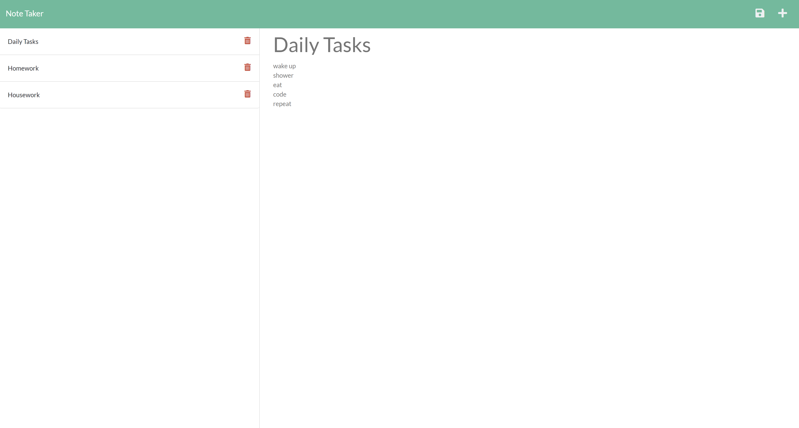

# Note Taker

## Table of Contents
  1. [Description](#description)
  2. [Usage](#usage)
  3. [Visuals](#visuals)
  4. [Credits](#credits)

## Description
[link to note taker](https://note-taker-hoffman.herokuapp.com/)\
The note taker app is a useful tool to take and store notes weather its for daily tasks or saving helpful information for a project

## Usage
When a user go to the [note taker](https://note-taker-hoffman.herokuapp.com/) they will click the Get Started button to be sent to the note taking page\
The user then can add a title and description to a new note and then click the save button in the top right corner\
If a user wishes to delete a note they can click the trashcan button next to the selected note

## Visuals

## Credits
Christian Hoffman